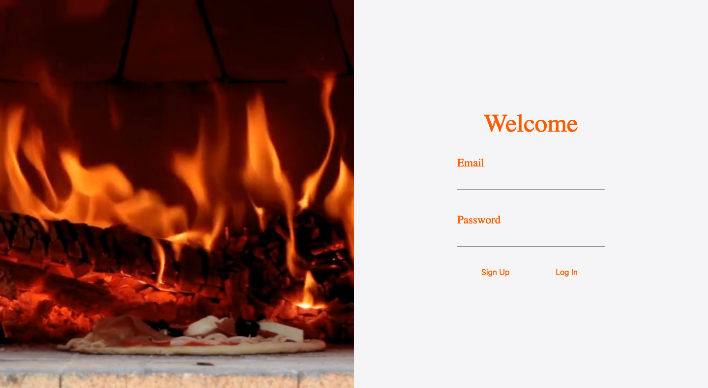
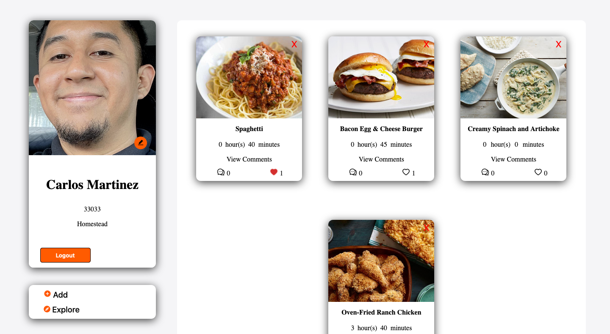
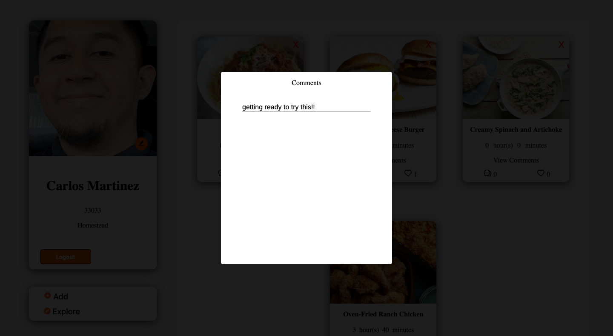
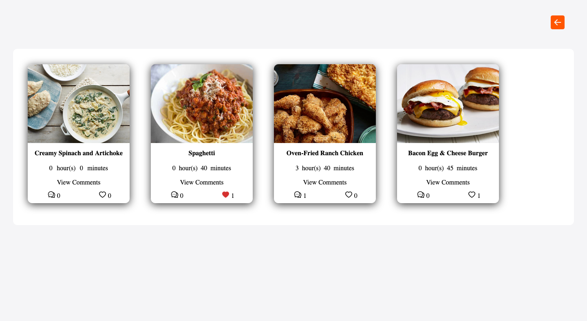
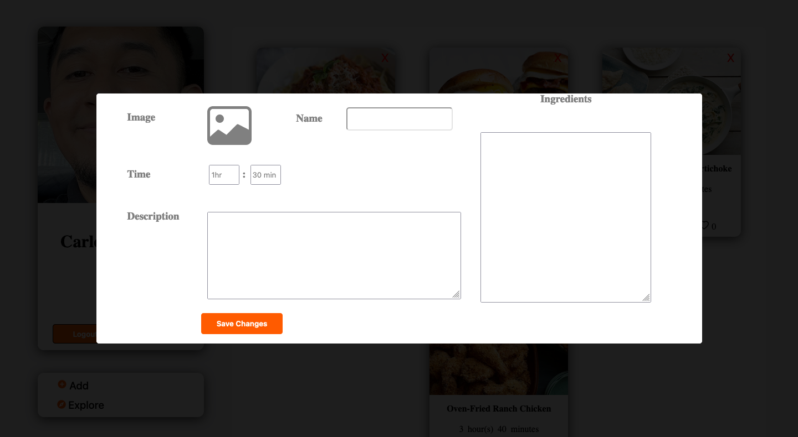
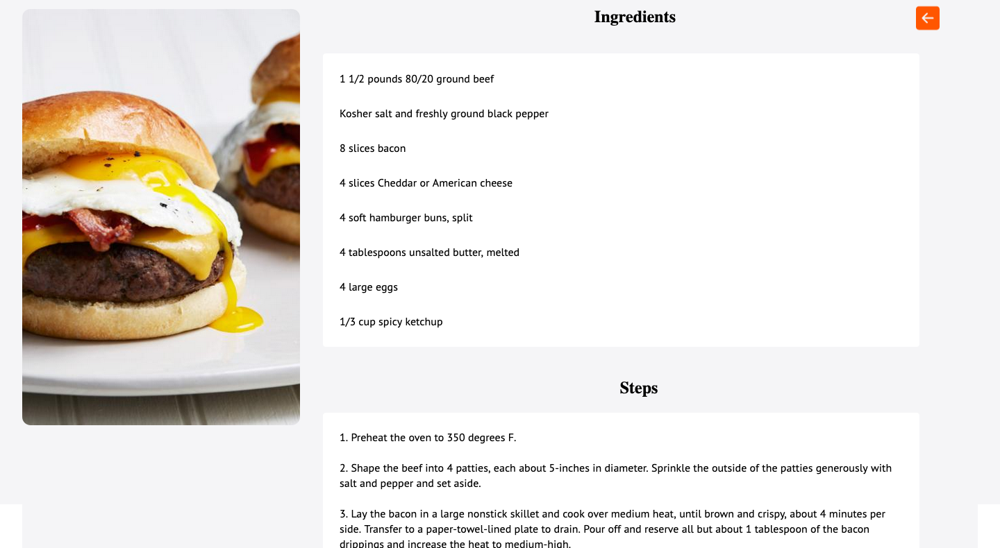
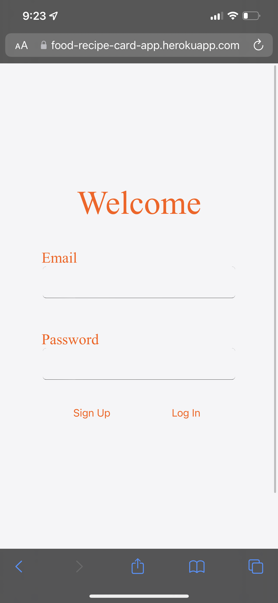
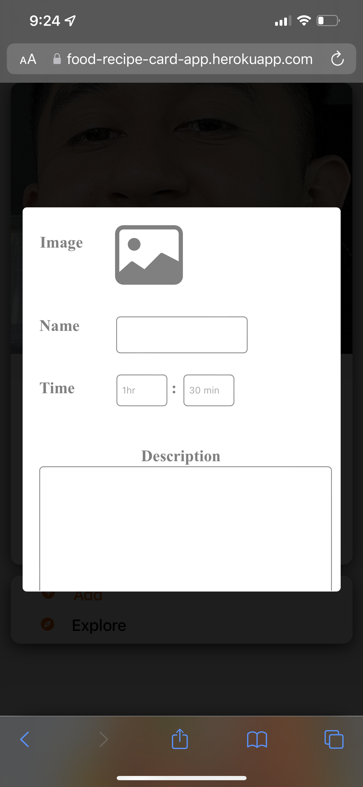
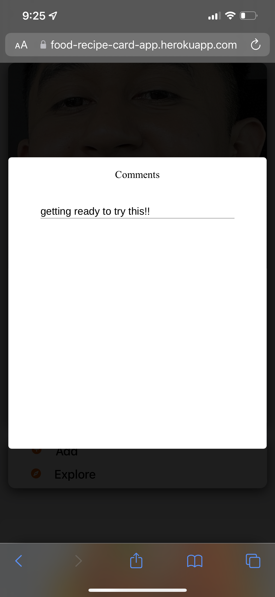

# Recipe App

### About the Project
Project was built with the following tools:  

- Javasript
- React
- Express
- Node Js
- PostgreSQL
- AWS S3  
- Scoket.IO
 

## Usage
This project was built to learn the usage of Socket.io or in other words Websockets. The website allows the user to post food recipes. In posting these recipes user are also able to go to an explore page showing other random post queried by the server. Lasty users are able to like and comment on other user;s post. Using Socket.io to update the count of the likes and counts of the recipes user's post.

## Website Screenshot

### Sign-up Page
  

### Profile Page

### Comments
  

### Explore Page
  
  
### Posting Recipe Modal

### Recipe Information

## Mobile Screenshot

### Mobile Login

### Mobile Home Page

### Mobile Explore Page

### Mobile Recipe Modal

### Mobile Comment

### Mobile Recipe Information

